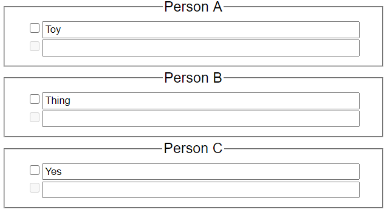
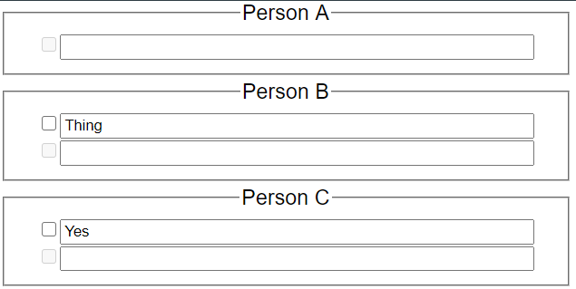

Gift List
=============

**Working Program:** [https://gift-list.glitch.me/](https://gift-list.glitch.me/)

**Features:** _Gift List_ allows members of a family to collaborate on each other's gift lists.
However, unlike a regular document, your gifts added by other members of the family are not visible to you.
For example:

| Person C Adds: | Person A Sees: |
| --- | --- |
|  |  |

**How to Use:** Once running, login or create a new family by pressing the respective buttons.
You can change your family code when creating an account, but remember it as the code will be needed for all other
devices.

**Setup Locally/Contribute:**
Creates a private server that can only be accessed exclusively by members of the same network
1. Prerequisites: have [node.js](https://nodejs.org/en/) installed
2. Either:
    1. Run "`git clone https://github.com/funblaster22/Modpack-Creator.git`" (requires [git](https://git-scm.com/downloads))
    2. [Download zip](https://github.com/funblaster22/Modpack-Creator/archive/Main.zip) and extract
3. Run "`npm install`" in the same directory as this project
4. Run "`npm start`" and wait
5. [Obtain your local IP address](https://lifehacker.com/how-to-find-your-local-and-external-ip-address-5833108)
6. Type that IP address into any device on your network plus "`:3000`", which is the port number (eg: `10.0.0.51:3000`)
7. Note: the program must remain running for the website to be accessible

**Upcoming Features:**
- [ ] Display notice on request error
- [ ] Filter gifts server-side
- [ ] Handle merge conflicts (if 2 people use simultaneously)
- [ ] approval process for new IP addresses
- See TODOs in source

Made by [funblaster22](https://glitch.com/@ethan.d.python), licensed under [GNU GPLv3](https://www.gnu.org/licenses/gpl-3.0.en.html)
-------------------
